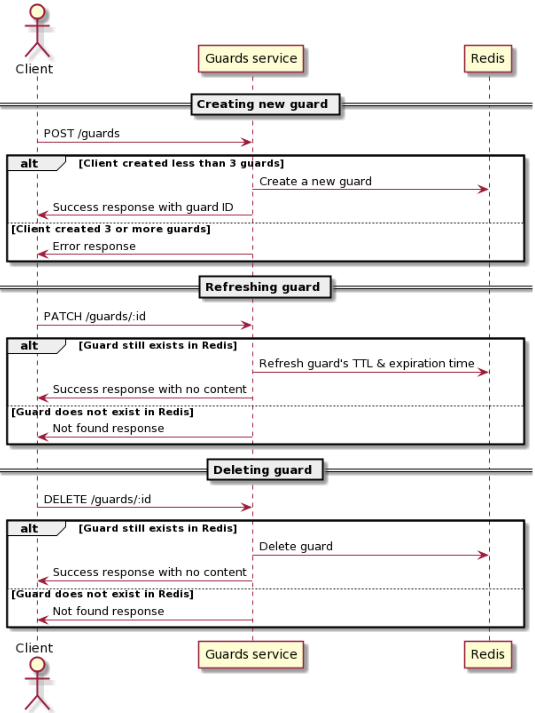

## Service Flow

Service flow is shown on Picture 1.


**Picture 1.** *Service flow.*


## Endpoints

### 1. POST */guards*

### Request
- Headers:
    - `x-user-id` - *contains user ID*

### Response

#### :white_check_mark: Successful response (200)
```JSON
{
    "guardId": "cf0190e1-285d-4967-97f3-b0738e56766a"
}
```

#### :x: Trying to create an excess guard (403)
```JSON
{
    "message": "Reached max guards count",
    "errorCode": "REACHED_MAX_GUARDS_COUNT"
}
 ```

#### :x: Guard did not save (500)
```JSON
{
    "message": "Failed to create guard",
    "errorCode": "FAILED_TO_CREATE_GUARD"
}
 ```

#### :x: Unexpected error (500)
```JSON
{
    "message": "An error occurred while creating guard",
    "errorCode": "COULD_NOT_CREATE_GUARD"
}
 ```


### 2. PATCH */guards/`:id`*

### Request
- Headers:
    - `x-user-id` - *contains user ID*
- Params:
    - `id` - *guard ID*

### Response

#### :white_check_mark: Successful response (200)
```JSON
{
    "guardId": "cf0190e1-285d-4967-97f3-b0738e56766a"
}
```

#### :x: Trying to refresh non-existent guard (404)
```JSON
{
    "message": "Guard does not exist",
    "errorCode": "GUARD_DOES_NOT_EXIST"
}
 ```

#### :x: Guard did not save (500)
```JSON
{
    "message": "Failed to create guard",
    "errorCode": "FAILED_TO_CREATE_GUARD"
}
 ```

#### :x: Unexpected error (500)
```JSON
{
    "message": "An error occurred while refreshing guard",
    "errorCode": "COULD_NOT_REFRESH_GUARD"
}
 ```


### 3. DELETE */guards/`:id`*

### Request
- Headers:
    - `x-user-id` - *contains user ID*
- Params:
    - `id` - *guard ID*

### Response

#### :white_check_mark: Successful response (200)
```JSON
{
    "guardId": "cf0190e1-285d-4967-97f3-b0738e56766a"
}
```

#### :x: Trying to delete non-existent guard (404)
```JSON
{
    "message": "Guard does not exist",
    "errorCode": "GUARD_DOES_NOT_EXIST"
}
 ```

#### :x: Guard was not deleted (500)
```JSON
{
    "message": "Failed to delete guard",
    "errorCode": "FAILED_TO_DELETE_GUARD"
}
 ```

#### :x: Unexpected error (500)
```JSON
{
    "message": "An error occurred while deleting guard",
    "errorCode": "COULD_NOT_DELETE_GUARD"
}
 ```
